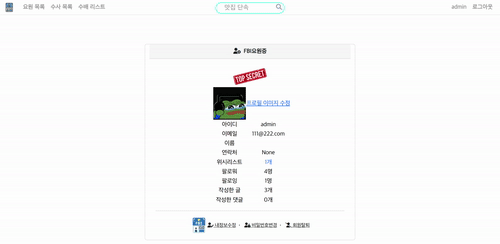

# Brokuly🥦

> 맛집 후기 사이트 [ FBI ] project

## 📜 General info

- 시연 사진
  
  

- 
  
  개발기간 : 2022. 11. 01 - 2022. 11. 08

- 팀원
  
  - Front-end([김민찬](https://github.com/kmckmc5587), [우상민](https://github.com/wsm0409))
  - Full-stack([이태극](https://github.com/uRo3YA/))

## 💻Technologies

### Technology stack

- Version Control and Messenger
  
   

- Backend and Testing
  
   

- Frontend
  
     

## 🔍Features

### 담당 역할

#### 이태극

- Fullstack
- Crawling
- Bug Fix

### 기능 소개

# 

### User APP

- 로그인, 로그아웃
  
  > 로그인, 로그아웃 기능 구현
* 위시리스트
  
  > 상품 상세에서 비동기로 추가 기능 구현

* 유저가 작성한 리뷰/댓글 목록
  
  > 유저가 작성한 리뷰 목록을 마이페이지에서 조회 가능
- 팔로우 기능
  
  > 비동기 통신으로구현
  > 팔로잉, 팔로워를 모두 모달 형식으로 볼 수 있게 구현

### Restaurant APP

- index 페이지
  
  > 가게별 이미지 효과

- 상세 페이지
  
  > 가게 리뷰는 하단 게시판 형식으로 제작

- CRUD
  
  > API 호출을 통한 지도 구현 및 지오코딩을 이용한 위도 경도 획득

- 크롤링
  
  > 크롤링을 통한 데이터 획득 및 대량 등록

- 검색 기능
  
  > Q 모듈을 이용한 검색기능

- 위시리스트 기능
  
  > 비동기 통신으로구현

### Reviews APP

- CRUD
  
  > 섬머노트를 이용한 에디터 삽입

- 추천
  
  > 비동기 통신으로 구현

- 댓글
  
  > 비동기 통신으로 구현

## 💬Reviews

- 이태극
  
  - 시간여건상 구현하지 못한 기능이 많았다... 시간 여유가 생기면 반드시 업데이트 할 예정
  - 배포에는 실패했는데 초기 설정을 잘못잡아서 실패한게 더욱 아쉽다.
  - 사실상 혼자서 개발한 프로젝트...정말 힘들었다.
